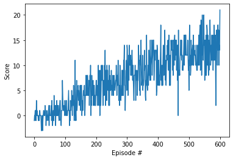

# report

With project recomendation i start coping dqn files and navigation files, then the first change is in model where i change state_size for 37.

After i implement all code by traing an Agent for check if input and output was correct.

The number of nodes in hidden layer was find by test with 148 and 296 nodes where 296 nodes have best score by the graph.

The batch_size and update_every values as seted considering enverinmont time stemp.

The epsilon_decay value as seted considereng start_epsilon and end_epsilon where the epsilon decrease in each episode, 
this define more learning action and less random action along the episodes.

this graph bellow show average score for episode.

For future i wound like to use generic algoritms for test the hyperparameters.